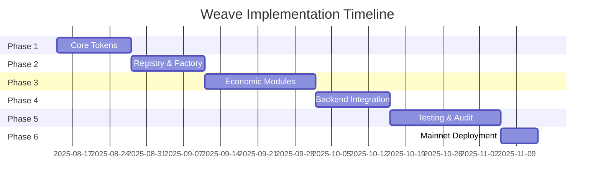

# Weave Ecosystem Implementation Plan

**Version**: 1.0  
**Date**: August 13, 2025  
**Timeline**: 12-16 weeks  
**Team Size**: 2-4 developers

## Executive Summary

This implementation plan outlines a phased approach to building the Weave ecosystem on Tapestry L2. The plan prioritizes core functionality, ensures thorough testing at each phase, and maintains flexibility for adjustments based on learnings.

## Phase Overview



## Phase 1: Foundation (Weeks 1-2)

### Goals
- Set up development environment
- Implement core token contracts
- Establish testing framework

### Tasks

#### Week 1: Environment Setup
- [ ] Initialize Foundry project
- [ ] Configure development environment
- [ ] Set up CI/CD pipeline
- [ ] Create project structure

```bash
# Commands to run
forge init --no-commit
forge install OpenZeppelin/openzeppelin-contracts
forge install OpenZeppelin/openzeppelin-contracts-upgradeable
```

#### Week 2: Core Tokens
- [ ] Implement DYEToken (ERC-20)
- [ ] Implement hUSDCToken (ERC-20)
- [ ] Implement CRONToken (ERC-721)
- [ ] Write unit tests for each token

### Deliverables
- Working development environment
- Basic token contracts with tests
- CI/CD pipeline running tests

### Success Criteria
- All tokens deployable to local testnet
- 100% test coverage for token contracts
- Gas optimization benchmarks established

## Phase 2: NFT Infrastructure (Weeks 3-4)

### Goals
- Implement semi-fungible token contracts
- Create provider registry system
- Build token interaction logic

### Tasks

#### Week 3: ERC-1155 Implementation
- [ ] Implement WEAVEToken (ERC-1155 + Soulbound)
- [ ] Implement FIBERToken (ERC-1155 Collections)
- [ ] Create ProviderRegistry contract
- [ ] Implement token metadata systems

#### Week 4: Registry & Factory Base
- [ ] Implement WeaveRegistry contract
- [ ] Create WeaveFactory base contract (UUPS)
- [ ] Implement access control systems
- [ ] Write integration tests

### Deliverables
- Complete NFT token system
- Provider management infrastructure
- Registry pattern implementation

### Success Criteria
- Multi-provider token minting works
- Soulbound mechanics properly enforced
- Registry correctly manages addresses

## Phase 3: Economic Engine (Weeks 5-7)

### Goals
- Implement core economic mechanics
- Create pool and pricing systems
- Build entitlement distribution

### Tasks

#### Week 5: Entitlement System
- [ ] Implement EntitlementManager
- [ ] Create CRON creation logic
- [ ] Build expiry processing system
- [ ] Implement time-based restrictions

#### Week 6: Sponsorship Modules
- [ ] Implement AdvertiserModule
- [ ] Implement VendorModule
- [ ] Create subsidy/premium mechanics
- [ ] Build sponsored CRON creation

#### Week 7: Pool & Pricing
- [ ] Implement SimpleCRONPool (AMM)
- [ ] Create DynamicFeeManager
- [ ] Build inventory tracking system
- [ ] Implement price discovery mechanics

### Deliverables
- Complete entitlement distribution system
- Working sponsorship mechanics
- Functional AMM pool with dynamic pricing

### Success Criteria
- Users can claim entitlements every 6 hours
- Sponsored CRONs properly track subsidies/premiums
- Pool correctly prices based on inventory

## Phase 4: Integration Layer (Weeks 8-9)

### Goals
- Complete smart contract integration
- Implement backend connection points
- Create monitoring systems

### Tasks

#### Week 8: Contract Integration
- [ ] Complete WeaveFactory orchestration
- [ ] Implement Treasury contract
- [ ] Create batch processing functions
- [ ] Build emergency pause systems

#### Week 9: Backend Interfaces
- [ ] Create event emission system
- [ ] Implement oracle interfaces
- [ ] Build backend callback mechanisms
- [ ] Create admin functions

### Deliverables
- Fully integrated smart contract system
- Backend-ready interfaces
- Administrative tools

### Success Criteria
- End-to-end flow works on testnet
- Events properly emitted for indexing
- Admin functions properly secured

## Phase 5: Testing & Security (Weeks 10-12)

### Goals
- Comprehensive testing coverage
- Security audit preparation
- Performance optimization

### Tasks

#### Week 10: Testing Suite
- [ ] Write comprehensive unit tests
- [ ] Create integration test scenarios
- [ ] Implement invariant testing
- [ ] Build fuzzing tests

#### Week 11: Security Hardening
- [ ] Internal security review
- [ ] Gas optimization pass
- [ ] Implement circuit breakers
- [ ] Create migration scripts

#### Week 12: Audit Preparation
- [ ] Documentation cleanup
- [ ] Prepare audit package
- [ ] Fix any identified issues
- [ ] Create deployment scripts

### Deliverables
- Complete test suite with >95% coverage
- Security audit package
- Optimized contracts

### Success Criteria
- All tests passing
- Gas costs within acceptable ranges
- No critical vulnerabilities found

## Phase 6: Deployment (Weeks 13-14)

### Goals
- Deploy to testnet
- Conduct final testing
- Prepare for mainnet

### Tasks

#### Week 13: Testnet Deployment
- [ ] Deploy all contracts to testnet
- [ ] Verify all contracts
- [ ] Run integration tests on testnet
- [ ] Set up monitoring

#### Week 14: Mainnet Preparation
- [ ] Address audit findings
- [ ] Final contract updates
- [ ] Prepare mainnet deployment
- [ ] Create operational runbooks

### Deliverables
- Live testnet deployment
- Verified contracts
- Operational documentation

### Success Criteria
- Testnet deployment stable for 7 days
- All audit findings addressed
- Mainnet deployment plan approved

## Phase 7: Backend Development (Parallel Track)

### Goals
- Build backend processing system
- Integrate with AI services
- Create monitoring dashboard

### Tasks (Weeks 5-12, parallel)
- [ ] Set up Node.js backend
- [ ] Integrate OpenAI API
- [ ] Build IPFS integration
- [ ] Create job queue system
- [ ] Implement cost tracking
- [ ] Build admin dashboard
- [ ] Create monitoring systems

### Deliverables
- Working backend system
- AI integration complete
- Monitoring dashboard

## Technical Milestones

### Milestone 1: Token System Complete (Week 4)
- All 5 tokens implemented and tested
- Provider registry functional
- Basic interactions working

### Milestone 2: Economic Model Live (Week 7)
- Entitlements distributing
- Sponsorships working
- Pool providing liquidity

### Milestone 3: Testnet Launch (Week 13)
- Full system deployed
- Backend connected
- End-to-end flows working

### Milestone 4: Mainnet Ready (Week 16)
- Audit complete
- All issues resolved
- Production deployment approved

## Risk Mitigation

### Technical Risks
| Risk | Mitigation |
|------|------------|
| Smart contract bugs | Extensive testing, formal verification for critical paths |
| Gas costs too high | Early optimization, consider L2-specific optimizations |
| Oracle failures | Fallback mechanisms, manual override capabilities |
| Backend scalability | Queue system, horizontal scaling preparation |

### Timeline Risks
| Risk | Mitigation |
|------|------------|
| Audit delays | Book auditor early, have backup options |
| Integration issues | Parallel development tracks, early integration tests |
| Scope creep | Clear phase boundaries, defer nice-to-haves |

## Resource Requirements

### Development Team
- **Lead Solidity Developer**: Full-time
- **Backend Developer**: Full-time from Week 5
- **Smart Contract Developer**: Full-time
- **DevOps/Testing**: Part-time throughout

### Infrastructure
- Development environment (Foundry, Hardhat)
- Testnet ETH for deployments
- IPFS node or Pinata subscription
- OpenAI API credits for testing
- Monitoring services (Tenderly, OpenZeppelin Defender)

### Budget Estimates
- Development: $150-200k (3-4 developers, 4 months)
- Audit: $30-50k (depending on firm and scope)
- Infrastructure: $5-10k (testing and initial operations)
- Buffer: 20% contingency

## Definition of Done

### For Each Phase
- [ ] All code written and reviewed
- [ ] Unit tests achieving >95% coverage
- [ ] Integration tests passing
- [ ] Documentation updated
- [ ] Gas optimization completed
- [ ] Security considerations addressed

### For Overall Project
- [ ] All contracts deployed and verified
- [ ] Backend system operational
- [ ] Monitoring in place
- [ ] Documentation complete
- [ ] Audit passed
- [ ] Operational runbooks created

## Next Steps

### Immediate Actions (This Week)
1. Set up development environment
2. Create GitHub repository structure
3. Initialize Foundry project
4. Begin Phase 1 implementation

### Planning Actions
1. Book security audit slot
2. Secure development resources
3. Set up project management tools
4. Create communication channels

## Success Metrics

### Technical Metrics
- Gas cost per FIBER: <200,000 gas
- Transaction success rate: >99.9%
- System uptime: >99.5%
- Test coverage: >95%

### Business Metrics (Post-Launch)
- Daily active users
- FIBER creation rate
- Platform revenue vs costs
- Inventory turnover rate

## Appendix: Development Checklist

### Smart Contract Checklist
- [ ] Use latest Solidity version (0.8.20+)
- [ ] Implement custom errors
- [ ] Optimize storage layout
- [ ] Use events for logging
- [ ] Implement access control
- [ ] Add emergency pause
- [ ] Include reentrancy guards
- [ ] Validate all inputs
- [ ] Handle all edge cases
- [ ] Document with NatSpec

### Testing Checklist
- [ ] Unit tests for each function
- [ ] Integration tests for workflows
- [ ] Invariant tests for economics
- [ ] Fuzzing for edge cases
- [ ] Gas profiling
- [ ] Mainnet fork testing
- [ ] Load testing
- [ ] Failure scenario testing

### Deployment Checklist
- [ ] Contracts compiled with optimization
- [ ] Deployment scripts tested
- [ ] Verification scripts ready
- [ ] Admin keys secured (multisig)
- [ ] Monitoring configured
- [ ] Incident response plan
- [ ] Rollback plan prepared
- [ ] Documentation published

---

*This implementation plan is a living document and should be updated as the project progresses and new information becomes available.*